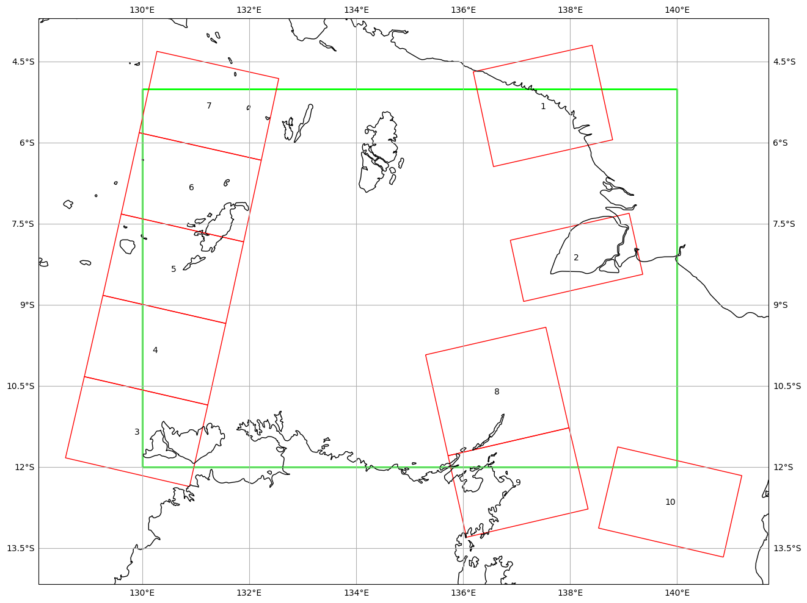

# SARA Client Downloader

## Installation
### 1. Install auscophub-1.2.1
- Download [auscophub-1.2.1](https://github.com/CopernicusAustralasia/auscophub/releases/download/1.2.1/auscophub-1.2.1.zip) or you can check the latest one in [here](https://github.com/CopernicusAustralasia/auscophub/releases)
- Extract it
- Install it through:
```
cd auscophub-1.2.1
python -m pip install .
```
or
```
cd auscophub-1.2.1
python setup.py install
```

### 2. Install other dependencies
#### Linux and MacOS
Install through `requirements.txt` file directly
```
python -m pip install -r requirements.txt
```
#### Windows
- Install **pipwin** using `python -m pip install pipwin`
- Run `pipwin refresh`
- Install **GDAL**, **Fiona** and **Cartopy** using `pipwin install <package name>`
```
pipwin install gdal
pipwin install fiona
pipwin install cartopy
```
- Install remaining dependencies through `requirements.txt` file
```
python -m pip install -r requirements.txt
```

## Usage
- Import modules
```
import os
from saraclient_downloader import GetData, DownloadFile
```
- Get data availablilty in SARA client using `GetData` class with passing such parameters: _startdate_, _enddate_ and _polygon_ file. And it will return list of __FeatureCollection__ if succeed, which contain data information including data URL.
```
startdate = "2021-10-28" # yyyy-mm-dd
enddate = "2021-10-28" # yyyy-mm-dd
polygon = "aoi.geojson" # or other geospatial shape format
data = GetData(startdate, enddate, polygon)
results = data.get_results()
```
- (Optional) we can also plot the result using matplotlib
```
import geopandas as gpd
from saraclient_downloader import plotting

result_gdf = data.get_geodataframe()
polygon_gdf = gpd.read_file(polygon)
fig = plotting(polygon_gdf, result_gdf, figsize=(15,10))
fig.savefig("results.png, bbox_inches="tight")
```

- Download data using `DownloadFile` class and pass it with data _url_ and _output_path_ where data will be stored and SARA client authentication (_username_ and _password_).
```
username = "your SARA client username"
password = "your SARA client password"

# As 'results' is a list, we should iterate each feature to obtain information
for result in results:
    url = result["services"]["download"]["url"]
    filename = result["properties"]["productIdentifier"]
    output_path = os.path.join("C:\download", f"{filename}.zip")
    DownloadFile(url, output_path, username, password).download()
```